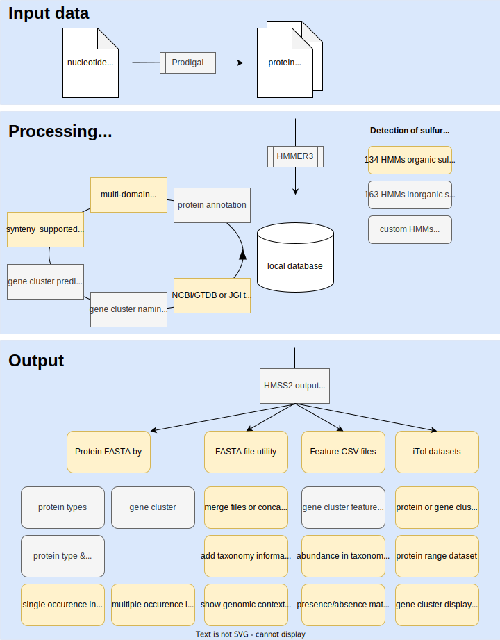

# HMSS2

HMSS2: a tool for the identification of sulfur metabolism-related genes and analysis of operon structures in genome and metagenome assemblies. The tool searches fasta files for sulfur metabolism associated proteins using hidden markov models and defined threshold scores. Furthermore, the genes of the detected proteins are analyzed for their position in the genome. The detected gene clusters are then named with a keyword if it is a known pattern of a gene cluster. HMSS2 can also be extended with other compatible HMMs.

## Installing HMSS2 on Linux
You can install HMSS2 by downloading it directly from GitHub in compiled or non-compiled form.

1. Download the latest release from github

2. In a terminal, 'cd' to the downloaded package

3. Extract the files

4. Test you can run by './HMSS2/HMSSS -h' for the [precompiled version](https://github.com/TSTanabe/HMSS2/releases/download/v1.0.5/HMSS2.zip) or 'python HMSS2/HMSSS.py -h' for the [uncompiled version](https://github.com/TSTanabe/HMSS2/releases/download/v1.0.5/HMSS2_source.zip)

5. Installation of required external programs HMSS2 depends on:

    5.1 [Prodigal](https://github.com/hyattpd/Prodigal) for translation of nucleotide fasta
    
    5.2 [HMMER3](http://hmmer.org/) for the detection and annotation
    
    5.3 `pip install biopython` if you are using the uncompiled version
  
6. That's it! You can now run HMSS2 on a directory of protein sequence fasta files with gff files or nucleotide fasta files

## Running HMSS2

To run HMSS2 on your own data type in the command line:

./HMSSS -f Directory

Replace "Directory" with the directory containing your input fasta files, with one file per species. The names of the files should match the identifiers of the genomes, since the name of the files will later be used for identification. When using protein fasta files with gff files, the names of the related files should be the same except for the file extension. File names will be used as genome identifiers. HMSS2 will look for input fasta files with any of the following filename extensions:

* .fna or fna.gz
* .faa or .faa.gz
* .gff or .gff.gz
* .fasta

In case of any present file with .fna extension HMSS2 will try to transcripe to protein fasta via prodigal. Annotation and gene cluster prediction is then automatically performed.

Protein sequences detected by the hidden Markov Models can be retrieved with `-fd` followed by the names of the desired proteins. All proteins of a named gene cluster can be retrieved with the `-fk` command followed by the keywords of the desired gene cluster(s). Both commands combined retrieves all sequences matching both, the given keyword(s) and the given domain(s).

<figcaption>HMSS2 process overview. External programs are Progal and HMMER3. The input can consist of either assemblies with nucleotide sequences or protein sequences in fasta format with corresponding GFF3 files. New features of HMSS2 are marked in yellow. </figcaption>

## Result files
The results are stored in the local database and only output on request. the `-fd` or `-dfd` option can be used for this (see also command options). Each request generates a new folder with a unique timestamp that includes all generated files:

* **report.txt** is a tab separated file with a summary of the metadata of the output sequences. Columns of this file report the proteinID, domains, domains scores, domain coordinates in the proteins sequence, as well as the contig, gene stat and end, strand and locustag. If a genecluster is present the keyword , completeness of the gene pattern and collinearity is also added to this list. The columns of this file described the following data:
        
        proteinID get_domains domain_scores domain_coordinates gene_contig gene_start gene_end gene_strand gene_locustag keyword completeness csb taxonomy_lineage 
        RS_GCF_000025485 RS_GCF_000025485-NC_013851.1_1249 oxDsrC 173 3:112 NC_013851.1 1443433 1443771 + RS_GCF_000025485_9 oxDsr,oxDsrMK 1.0,1.0 0,1 RS_GCF_000025485_Bacteria__Proteobacteria_Gammaproteobacteria_Chromatiales_Chromatiaceae_Allochromatium_Allochromatium-vinosum
        [...]

* **protein_type.faa** is a FASTA formatted file with all sequences of a specific protein type.
* **protein_type_singleton.faa** is FASTA formatted file with all sequences of the protein type that only occured once per genome and therefore have no paralogous sequence
* **protein_type_doublicate.faa** is FASTA formatted file with all sequences of the protein type that occured at least twice per genome and therefore have paralogous sequences
* **keywords_(keyword).faa** is FASTA formatted file with all sequences of a protein type occuring in a gene cluster with a defined keyword
* **absolute_count** is a tab separated file with the number of genomes in a taxonomic lineage encoding for each protein type/keyword that was requested in the query
* **relative_count** is a tab separated file with the percentage of genomes in a taxonomic lineage encoding for each protein type/keyword that was requested in the query
* **iTol_binary_dataset.txt** is a iTol binary dataset file with the presence/absence matrix for each protein/keyword requested. The genome identifier and the taxonomic information is used as identifier for each line in the dataset.
* **iTol_taxon_domain_dataset.txt** is a iTol domain dataset file with the that is only generated when the `-add_genomic_context` option is used on an already existing FASTA file. The genome identifier and the taxonomic information is used as identifier for each line in the dataset. The dataset represents the genomic vicinity of each protein in the original FASTA file.
* **faa.taxonomy** is a fasta formatted file that is only generated when the `-add_taxonomy` option is used on an already existing FASTA file. The the identifiers for each sequence in the file is exchanged to the taxonomic lineage, matching the same identifiers as in the iTol dataset files.
* **gene_vicinity** is a tab separated file that is only generated when the `-add_genomic_context`option is used on an already existing FASTA file. For each protein in the file the adjacent genes are listed in the resulting file. As more than one copy per protein type may occur the list is indexed in relation to the originally selected protein. Thus, the index 0 corresponds to the protein from the FASTA file. 

        Index ProteinID Domain(s) Hit_score hit_align contig start end strand Superkingdom Clade Phylum Class Ordnung Family Genus Species
        0	RS_GCF_900102855-NZ_FMWD01000005.1_179	oxDsrC	152	0:112	NZ_FMWD01000005.1	203348	203686	+	Bacteria		Proteobacteria	Gammaproteobacteria	Thiohalomonadales	Thiohalomonadaceae	Thiohalomonas	Thiohalomonas denitrificans
        1	RS_GCF_900102855-NZ_FMWD01000005.1_183	oxDsrA	779	0:416	NZ_FMWD01000005.1	206250	207503	+	Bacteria		Proteobacteria	Gammaproteobacteria	Thiohalomonadales	Thiohalomonadaceae	Thiohalomonas	Thiohalomonas denitrificans
        2	RS_GCF_900102855-NZ_FMWD01000005.1_184	oxDsrB	732	2:356	NZ_FMWD01000005.1	207590	208660	+	Bacteria		Proteobacteria	Gammaproteobacteria	Thiohalomonadales	Thiohalomonadaceae	Thiohalomonas	Thiohalomonas denitrificans
        3	RS_GCF_900102855-NZ_FMWD01000005.1_185	DsrE	246	0:130	NZ_FMWD01000005.1	208695	209087	+	Bacteria		Proteobacteria	Gammaproteobacteria	Thiohalomonadales	Thiohalomonadaceae	Thiohalomonas	Thiohalomonas denitrificans
        4	RS_GCF_900102855-NZ_FMWD01000005.1_186	DsrF	201	3:122	NZ_FMWD01000005.1	209120	209488	+	Bacteria		Proteobacteria	Gammaproteobacteria	Thiohalomonadales	Thiohalomonadaceae	Thiohalomonas	Thiohalomonas denitrificans
        5	RS_GCF_900102855-NZ_FMWD01000005.1_187	DsrH	156	0:99	NZ_FMWD01000005.1	209503	209802	+	Bacteria		Proteobacteria	Gammaproteobacteria	Thiohalomonadales	Thiohalomonadaceae	Thiohalomonas	Thiohalomonas denitrificans
        6	RS_GCF_900102855-NZ_FMWD01000005.1_188	oxDsrC	173	2:111	NZ_FMWD01000005.1	209848	210183	+	Bacteria		Proteobacteria	Gammaproteobacteria	Thiohalomonadales	Thiohalomonadaceae	Thiohalomonas	Thiohalomonas denitrificans
        7	RS_GCF_900102855-NZ_FMWD01000005.1_189	oxDsrM	417	3:240	NZ_FMWD01000005.1	210250	210975	+	Bacteria		Proteobacteria	Gammaproteobacteria	Thiohalomonadales	Thiohalomonadaceae	Thiohalomonas	Thiohalomonas denitrificans

## Command options

HMSSS also comes with several options which are scribed in the help accessed by `-h`.

### Define HMM library, gene cluster patterns file and other run options
* `-l` sets the HMM library. By default this is set to the library in the source folder which includes the sulfur related HMMs. However this library can either be extended by or changed to any other HMM library compatible with the HMMER3 package. 
* `-t` sets the threshold file. Specific threshold scores for each HMM in the library are located here in a tab separated file. Each name is assigned to threshold score. In case of extended libraries the threshold scores should be set here.
* `-p` sets the syntenic gene patterns to be detected. All genes are listed in a tab separated file. Each line corresponds to one syntenic cluster. Collinearity is defined by the order of appearence. The first word in the line defines the name of the whole genecluster and is used as keyword. A gencluster can be given several different keywords, but not the same one more than once.
*  `-c` sets the number of CPUs to be used by HMMER
*  `-nt` sets the number of nucleotides between two genes to be considered as syntenic. The distance is calculated between the closest ends of two genes.
*  `-mc` sets the minimal fraction of the gene cluster to be present to assign a keyword. if the match between the defined gene cluster pattern and the examined gene cluster is greater than this threshold, the corresponding keyword is given to the gene cluster. 
### Work step regulation
*  `-redo_csb` start at the collinear synthenic block prediction. This will only include data already stored in the database
*  `-redo_csb_naming`start at the synthenic block naming. This function restarts the comparison of gene clusters in the database with the entered gene cluster naming patterns. Old naming patterns are not overwritten.
*  `-redo_search` FASTA files wihich have already been searched and have an entry in the database will not be ignored but searched again.
*  `-redo_taxonomy` make the taxonomic assignment again.

### Result files and output
Results are stored in a local database which can be accessed to retrieve different results of interest. The local database can also be extended by later searched. If not defined before the search HMSS2 will create a new local database for each run.
*  `-r` sets the directory for all results to be stored.
*  `-db` sets the database to be created/extended or from which results should be retrieved
*  `-gtdb` sets the path to a metadata file from the GTDB. This is required if it is desired to use the taxonomic information from GTDB.

### Sequence FASTA File output
The output from a database requires the `-db` option to define the database from which the desired output is taken. As the output is normally a set of sequences from a certain protein, possibly with a defined genomic vicinity or from specified taxonomic group there are several options to limit the number of retrieved sequences. In the result directory for each attemptd to retreive sequences a new folder is created.

Limiting output to certain genomes:

*  `-dll` sets the level of taxonomy. If output should be limit to a group of organisms sharing the same taxonomic group this option sets the level of taxonomy between superkingdom and species.
*  `-dlt` sets the name of the taxonomic group. Together with `-dll` this defines the taxon for which results should be fetched
*  `-dlp` limits retrieved results to organisms which encode for the specified protein
*  `-dlk` limits retrieved results to organisms which encode for a genecluster with the specified keyword

Sequences for proteins can be retrieved and written to fasta files with the following commands:

*  `-fl` & `-ft` retrieve all sequences from all organisms of this taxon.`-fl` specifies taxonomic hirarchy level,`-ft` specifies the name of the taxon
*  `-fd` fetch sequences for proteins with the given domain. If several domains are desired these should be separated by whitespace characters. These will be handeled as connected by an logical OR, which means any protein matching one of the given domains will be retrieved.
*  `-fk` fetch sequences for proteins from geneclusters with the given keyword. If several keywords are desired these should be separated by whitespace characters. The connection between the keywords can be set to AND or OR by the `-kc` option. With AND proteins from geneclusters matching all given keywords will be fetched. Otherwise proteins from geneclusters matching any of the given keyword are retrieved. 
*  `-fd` & `-fk` in combination retrieves all sequences matching both, the given keyword(s) and the given domain(s).

Files always contain only one type of protein sequences. The output includes several files with reports of the written sequences and some subsets for proteins. Each file starts with a short summary of the given command, followed by the name of the protein whose sequences were written to the file. Proteins which have more than one domain previously detected by HMSSS are separately written to files and names by the all detected domains. Furthermore two subsets are prepared: 
  

### Dataset output without sequences
Information about the presence of given proteins and/or keywords in a taxon or species can be retrieved and written to tab separated files. This also includes iTol dataset compatible files but sequences will not be retrieved:

*  `-dfd` retrieve presence/absence in the genome for given protein
*  `-dfk` retrieve presence/absence in the genome for given keyword
*  `-dff` retrieve presence/absence in the genome for given proteins with two or more domains in a genome
*  `-dfpk` retrieve presence/absence in the genome for given protein inside a gene cluster with the given keyword(s)
*  `-dmc` minimum similarity between pattern and gene cluster to be considered present
*  `-dcb` retrieve presence/absence in the genome for given keyword

The output contains the number for the presence of the desired proteine/keywords at each taxonomy level in absolute and relative values, each normalized to the number of genomes in the given taxonomy level. An iTol binary dataset is also output, with the specified names consisting of the genome identifiers and the taxonomic line

### Processing result files
Protein sequences are written to files with identifiers retrieved from the local database. These FASTA formatted files can be directly used or are the basis for further file generation. HMSS2 comes with further tools to create additional files based on the initial output:

*  `-merge_fasta` Merges one or more files with .faa extension into a single file without doublicates. As argument specific files or a whole directory is taken
*  `-filter_fasta` filters sequences of a given FASTA file by length. Length is specified by -filter_limits
*  `-filter_limits` sets the minimal and maximal sequence length
*  `-concat_alignment` concats sequences stored in multiple files from the same genome into one concatenated sequence. Can also be used for unaligned sequences
*  `-add_taxonomy` creates a new file with the organism lineage information, retrieved from the database. Requires `-db` option with database location.
*  `-add_genomic_context` writes a list with the genomic context for each sequence.
*  `-create_gene_cluster_dataset` creates a iTol dataset with the genomic context of each given sequence. Headers in the new file will match the headers generated by the `-add_taxonomy` command
*  `-create_type_range_dataset` creates a iTol dataset with the proteins colored by type. Headers in the new file will match the headers generated by the `-add_taxonomy` command

## Extending the HMM library and gene cluster patterns

The **gene patterns**, **HMM library** and the **cutoff score file** can be found in the the **src** directory.  New Hidden Markov Models (HMMs) can be generated by hmmbuild function from the HMMER3 package. In this case score cutoff have to be adjusted manually. Alternatively predefined HMMs can be downloaded from databases like pfam or TIGERFAM and added to a library by simply concating the files of each HMM. Cutoff scores are commonly available on the corresponding website.
The cutoff scores are listed in the Thresholds file. This file is a four column tab separated file. First column includes the name of the HMM, followed by the standard cutoff score, the noise cutoff and the trusted cutoff. The noise cutoff corresponds to the score of the most dissimilar sequence, therefore the true positive with the lowest score. Using this score results in a very sensitive but unprecise detection. In contrast the trusted cutoff corresponds to the score of the true positive sequence before a false positive hit occurs. Using this score results in a precise but insensitive detection. The standard cutoff is the cutoff score with the best tradeoff between sensitivity and precision. The Threshold file can be appended by new lines in the same format, if custom HMMs are requested:

    AprM	40	338.2	35.2
    AsrA	237	328.8	162.2
    New_HMM	218	220	58.1

To run HMSS2 with additional custom HMMs or HMMs from public databases concat all desired HMMs into a single library file and define this library by the `-l` command. The score thresholds of all HMMs have to be written in a single tab separated file. The threshold file can be set by the `-t` command followed by the path to the corresponding threshold file.

The all gene cluster patterns to be recognized have to be stored in a tab separated file. First columns defines the keyword, which is assigned to gene clusters matching the pattern. The following columns define the names of the HMMs to be present in a gene cluster to be recognized. All columns have to be tab separated. Keywords are not required to be unique and the same keyword can match differend patterns:

    Sox	SoxX	SoxY	SoxZ	SoxA	SoxB	SoxC	SoxD
    oxDsr	oxDsrA	oxDsrB	oxDsrC	DsrE	DsrF	DsrH
    sHdr	sHdrC1	sHdrB1	sHdrA	sHdrH	sHdrC2	sHdrB2
    sHdr	sHdrC1	sHdrB1	sHdrA	sHdrH	sEtfA	sEtfB

The path to a custom gene cluster patterns file can be set with the `-p` command followed by the corresponding path.

## Taxonomy assignment

Taxonomic assignment to genomes with NCBI genome ID can be done automatically. For this, [NCBI taxdump](https://ftp.ncbi.nlm.nih.gov/pub/taxonomy/) must be downloaded from NCBI, unpacked and located in the src folder. Alternatively, the [GTDB taxonomy](https://data.gtdb.ecogenomic.org/releases/release207/207.0/) can be used.
If own genome identifiers are used, the taxonomic assignment needs a file containing the respective taxonomic information. This must be a tab separated file with the following columns:

    genomeID superkingdom clade phylum class order family genus species strain taxid biosample bioproject genbank refseq completeness contamination typestrain

With the exception of the first column, not all columns must contain values. The type strain column must contain either the value 0 or 1 to be evaluable. The Contamination and Completeness columns should contain values between 0 and 100.

